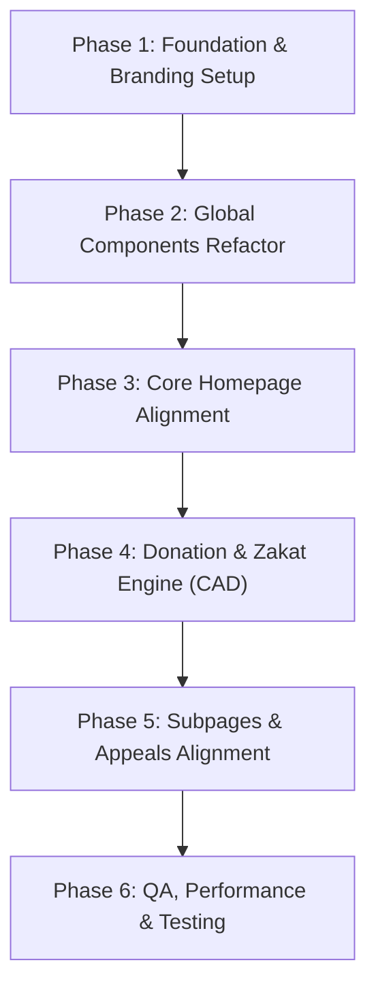

# MTJ Foundation Canada (mtjfoundation.ca) — WordPress to React.js Migration & Development Blueprint

**Target Website:** [https://mtjfoundation.ca/](https://mtjfoundation.ca/)  
**Platform Evolution:** WordPress (Hello Elementor + Elementor Pro + Fundraise Up) → React.js (SPA with React Router v7 & Modular CSS/Tailwind)  
**Entity:** MTJ Foundation Canada (Registered Charity CRA No: 780700423 RR 0001)  
**Primary Currency:** Canadian Dollar (CAD, $)  
**Date:** October 2026  

---

## 1. Executive Summary & Site Architecture Analysis

The live website `https://mtjfoundation.ca/` is an official Canadian charitable platform founded by Tariq Jamil (MTJ Foundation). It is designed to drive donations, emergency relief contributions, religious giving (Zakat & Sadaqah), and community awareness in Canada.

### Current WordPress Tech Stack Identified:
- **CMS / Theme:** WordPress 7.x with `Hello Elementor` & `Hello Elementor Child`.
- **Page Builder:** Elementor Pro 4.3.x.
- **Donation Gateway & Engine:** **Fundraise Up** (`cdn.fundraiseup.com/widget/ASCCZWLL`) embedded with webhook/listener sending `donationComplete` events to Google Scripts / Klaviyo.
- **Slider / Carousel Engine:** Slick Carousel (`slick-carousel/1.9.0`) & Swiper 8.4.5.
- **Typography:** Custom fonts `Rink` (headings), `Neueleiden`, Google Fonts `Inter`, `Roboto`, `Open Sans`, and FontAwesome 5.15.
- **Analytics & Tracking:** Microsoft Clarity (`r99xdowj1f`), Google Tag Manager (`GTM-K85CV3WF`), Linktree conversion pixel.
- **Custom Styling & Masking:** Custom scalloped stamp edge styling via CSS `mask` radial-gradients and polygon clip-paths for cards and buttons.

---

## 2. Complete Page & Routing Sitemap

| Section | URL Route (WordPress) | React Route (`react-router-dom`) | Description & Key Components |
|---|---|---|---|
| **Home** | `/` | `/` and `/home` | Hero banner (Nepal/Emergency), Support Campaigns Carousel, Impact Stats, Founder Video, Our Stories, Newsletter, Footer. |
| **Religious Giving** | `/zakat/` | `/zakat` | Zakat information, Nisab explanation, Interactive CAD Zakat Calculator card, Direct Zakat donation. |
| | `/sadaqah-jariyah/` | `/sadaqah` | Ongoing charity options, water wells, educational endowments, orphan care. |
| **Emergencies** | `/appeal/nepal-floods-appeal/` | `/nepal-floods` | Hero banner, flood situation report, impact statistics, donation tiers, gallery. |
| | `/emergency-relief-lebanon/` | `/emergency-relief-lebanon` | Lebanon emergency response, food packs, medical aid. |
| | `/emergency-relief-palestine/` | `/palestine-relief` | Urgent Palestine relief, medical packs, food supplies, daily hot meals. |
| | `/sri-lanka-floods/` | `/sri-lanka-floods` | Flood relief operations in Sri Lanka. |
| **Support Campaigns** | `/apna-ghar/` | `/apna-ghar` | Shelter and orphan home project. |
| | `/medical-healthcare/` | `/medical-care-health` | Mobile health units, clinics, patient support. |
| | `/food-relief/` | `/food-relief` | Food ration hampers and family sustenance. |
| | `/kasb/` | `/kasb` | Livelihood programs, micro-enterprise support. |
| | `/hot-meals/` | `/hot-meals` | Daily cooked food distribution. |
| | `/education/` | `/education` | Schools, educational materials, scholarships. |
| | `/clean-water/` | `/clean-water` | Hand pumps, deep water wells, filtration plants. |
| | `/online-islamic-counselling/`| `/online-islamic-counselling` | Faith-based mental and family counselling service. |
| **Who We Are** | `/about-us/` | `/about-us` | Vision, mission, values, founder Tariq Jamil's message, registration details. |
| | `/our-team/` | `/our-team` | Board of directors, management, and Canadian leadership. |
| | `/blogs/` | `/blogs` | Story archive, category filtering, search, paginated cards. |
| | `/reports/` | `/reports` | CRA annual financial statements and impact reports. |
| **Get Involved** | `/volunteer/` | `/volunteer` | Volunteer registration form, community chapters. |
| | `/events/` | `/events` | Upcoming charity dinners, webinars, tours. |
| | `/work-with-us/` | `/careers` | Job postings and application modal. |
| | `/contact-us/` | `/contact-us` | Canadian office address, phone, contact form, Google map. |
| **Legal / Compliance** | `/privacy-policy/` | `/privacy-policy` | Canadian PIPEDA compliant privacy policy & CRA charity disclosure. |

---

## 3. UI/UX Design System & Signature Elements

### 3.1 Color Palette
```css
:root {
  --color-primary-green: #22582D;      /* Main Emerald Green */
  --color-primary-green-hover: #1A4523;
  --color-dark-ink: #0B212A;           /* Deep Navy / Ink Black */
  --color-page-dark: #0B1F27;          /* Dark Teal behind stamps */
  --color-maroon: #6B0F1A;             /* Signature Maroon Accent */
  --color-maroon-light: #8F2634;
  --color-cream-bg: #FFFAEE;           /* Warm Sand / Cream Background */
  --color-cream-box: #FDF8EA;
  --color-gold: #FCB514;               /* Golden Amber */
  --color-white: #FFFFFF;
  --color-gray-100: #F7F7F7;
  --color-gray-400: #D5D8DC;
  --color-text-muted: #555555;
}
```

### 3.2 Typography Hierarchy
- **Brand / Headings Font:** `Rink`, `Sans-Serif` (bold, traditional yet modern high-contrast serif/display).
- **Body & Subtitles:** `Neueleiden`, `Inter`, `Roboto`, `Open Sans`.
- **Numbers / Metrics:** High-contrast bold display (`Rink` / `Montserrat`).

### 3.3 Signature MTJF Visual Motif: "The Stamp Scallop & Clip Mask"
The WordPress site features a distinctive scalloped postage-stamp edge on cards, buttons, and section dividers:
1. **Stamp Scalloped Edge Mask:**
   ```css
   .stamp-card {
     --r: 18px; /* scoop corner radius */
     mask:
       radial-gradient(circle var(--r) at 0 0, transparent 99%, #000) top left,
       radial-gradient(circle var(--r) at 100% 0, transparent 99%, #000) top right,
       radial-gradient(circle var(--r) at 100% 100%, transparent 99%, #000) bottom right,
       radial-gradient(circle var(--r) at 0 100%, transparent 99%, #000) bottom left,
       linear-gradient(#000 0 0);
     mask-size: 100% 100%, 100% 100%, 100% 100%, 100% 100%, cover;
     mask-repeat: no-repeat;
     mask-composite: exclude, exclude, exclude, exclude, add;
   }
   ```
2. **Notched Cream / Green CTA Button Clip-Path:**
   ```css
   .mtjf-btn-notched::before {
     clip-path: polygon(
       7px 0, calc(18.5% - 7px) 0, 18.5% 6px, calc(18.5% + 7px) 0,
       calc(50% - 7px) 0, 50% 6px, calc(50% + 7px) 0,
       calc(81.5% - 7px) 0, 81.5% 6px, calc(81.5% + 7px) 0,
       calc(100% - 7px) 0, calc(100% - 7px) 7px, 100% 7px,
       100% calc(50% - 7px), calc(100% - 6px) 50%, 100% calc(50% + 7px),
       100% calc(100% - 7px), calc(100% - 7px) calc(100% - 7px), calc(100% - 7px) 100%,
       calc(81.5% + 7px) 100%, 81.5% calc(100% - 6px), calc(81.5% - 7px) 100%,
       calc(50% + 7px) 100%, 50% calc(100% - 6px), calc(50% - 7px) 100%,
       calc(18.5% + 7px) 100%, 18.5% calc(100% - 6px), calc(18.5% - 7px) 100%,
       7px 100%, 7px calc(100% - 7px), 0 calc(100% - 7px),
       0 calc(50% + 7px), 6px 50%, 0 calc(50% - 7px),
       0 7px, 7px 7px
     );
   }
   ```

---

## 4. Frontend Component Breakdown (React.js)

### 4.1 Header & Navigation (`Navbar.jsx`, `Mobilenavbar.jsx`)
- **Desktop Navbar:**
  - Sticky glassmorphic or solid `#0B212A` / `#FFFFFF` transition on scroll.
  - Logo: Left-aligned Canada logo.
  - Dropdown Menu Hover/Click:
    - Religious Giving (Zakat, Sadaqah)
    - Emergencies (Nepal, Lebanon, Palestine, Sri Lanka)
    - Support Campaigns (Apna Ghar, Medical, Food, KASB, Hot Meals, Education, Clean Water, Counselling)
    - Who We Are (About Us, Our Team, Blogs, Reports)
    - Get Involved (Volunteer, Events, Careers, Contact Us)
  - CTA Button: "Quick Donate" with heartbeat SVG icon.
- **Mobile Navbar:**
  - Animated hamburger button.
  - Full-height off-canvas drawer with nested accordion items.
  - Floating sticky "Quick Donate" CTA at bottom for high conversion.

### 4.2 Homepage Sections
1. **Hero Section (`Hero.jsx`)**:
   - Adaptive hero slider / single hero for active emergency (e.g. Nepal Floods or Palestine).
   - Responsive background cutout (`Palestine-Cut-Out.png` or `Nepal-Mobile-Banner.jpg`).
   - Title, paragraph text, dual CTAs ("Donate Now", "Learn More").
2. **Campaign Carousel (`CategoryCarousel.jsx` / `CampaignCarousel.jsx`)**:
   - Powered by Swiper.js.
   - 4-card visible grid on desktop, 2 on tablet, 1.2 preview cards on mobile.
   - Cards display category badge, image, title, summary, and direct "Donate Now" trigger.
3. **Impact Statistics Section (`ImpactSection1.jsx`)**:
   - Animated counting numbers (0 to 500,000+) on scroll viewport entry using IntersectionObserver.
   - Circular icon badges (`#22582D36` background) with SVG medical, water, meal icons.
4. **Founder Video Highlight (`VideoSection.jsx`)**:
   - YouTube video embed modal with lazy-loaded thumbnail preview to maintain 100 Lighthouse performance.
   - Title & Tariq Jamil's mission statement.
5. **Our Stories / Blog Feed (`Ourstories.jsx`)**:
   - Category filter pills (All, Zakat, Emergencies, Health, Education) on desktop; styled select dropdown on mobile.
   - Scalloped blog post cards with author avatar, date, title, excerpt.
   - Navigation dots with custom SVG arrows.
6. **Newsletter Subscription (`Newsletter.jsx`)**:
   - Input box with email regex validation.
   - Form submission handler (Mailchimp API / serverless endpoint).
7. **Footer (`Footer.jsx`)**:
   - CRA registration statement & Canada charity number `780700423 RR 0001`.
   - 4-column link directory matching Canada site structure.
   - Social media links with icons.

---

## 5. Functional & Business Logic Architecture

### 5.1 Canadian Donation Engine (`DonationContext.jsx` & `DonationPopup.jsx`)
In the original WordPress site, donations are routed through **Fundraise Up** (`ASCCZWLL`). In React, we provide a hybrid model:
1. **Fundraise Up Integration:**
   - Inject Fundraise Up script via React hook `useFundraiseUp()`.
   - Trigger official Fundraise Up modal with prefilled campaign IDs:
     ```javascript
     window.FundraiseUp.openCheckout({
       campaign: campaignCode,
       amount: selectedAmount,
       frequency: frequency // 'once' | 'monthly'
     });
     ```
2. **Native Custom Donation Modal (Fallback / Direct Checkout):**
   - **Currency:** Canadian Dollars (**CAD, $**).
   - **Frequency:** One-Time vs Monthly recurring tabs.
   - **Predefined Amount Tiers:** $30, $50, $100, $250, $500, Custom.
   - **Designation Dropdown:** Specific appeals (e.g., Zakat, Palestine, Where Most Needed).
   - **Donor Information:** Name, Email, Address (for Canadian CRA Tax Receipts).

### 5.2 Zakat Calculator (`ZakatCalculatorCard.jsx`)
- **Asset Categories:**
  - Gold value (grams × live CAD gold price per gram).
  - Silver value (grams × live CAD silver price per gram).
  - Cash at bank & on hand (CAD).
  - Shares, investments, pensions (CAD).
  - Money owed to you (CAD).
  - Stock in trade / business assets (CAD).
- **Liabilities Deductions:**
  - Immediate debts, monthly bills, commercial debts.
- **Nisab Calculation:**
  - Silver Nisab (approx 612.36g) vs Gold Nisab (87.48g).
  - Threshold comparison: if Net Assets >= Nisab, calculate Zakat Payable = Net Assets × 2.5%.
- **Action:** One-click transfer of calculated Zakat amount into donation checkout.

---

## 6. Gap Analysis: Current Workspace vs. Live mtjfoundation.ca

After auditing the current workspace (`mtj-ca-website`), the following gaps were identified and must be addressed:

| Item | Current State in Repo | Live `mtjfoundation.ca` Requirement | Required Action |
|---|---|---|---|
| **Currency** | Hardcoded `PKR` and `Rs` in `DonationPopup.jsx` | Canadian Dollars (`CAD`, `$`) | Refactor `DonationPopup` to CAD defaults and clean tier amounts ($30, $50, $100, $250, etc.). |
| **Package Identity** | Named `"uk_mtjf_website"` | MTJF Canada (`mtjf_canada_website`) | Update `package.json` name, title, and metadata. |
| **New Pages** | Missing `/online-islamic-counselling` | Present in header menu | Create page component `OnlineIslamicCounselling.jsx` and route. |
| **Footer Component** | Two footers exist (`Footer.jsx` vs `FooterNew.jsx`) | `Footer.jsx` matches Canada CRA details; `FooterNew` has placeholder "About TH" content | Clean up and consolidate into a single Canada footer. |
| **Fundraise Up Bridge** | Standard popup only | Live site uses Fundraise Up SDK (`ASCCZWLL`) + Google Sheets hook | Add `useFundraiseUp` hook or integrate SDK cleanly into `DonationContext`. |
| **SEO & Meta Tags** | Basic CRA title | Yoast SEO metadata, OpenGraph tags, CRA charity structured data schema | Implement `react-helmet-async` for page-specific titles and meta tags. |

---

## 7. Phased Implementation Roadmap



### Phase 1: Foundation & Branding Setup
- Update `package.json`, `index.html` title, Canadian favicons, and Yoast OpenGraph meta.
- Verify fonts: Load `Rink` and `Neueleiden` font files correctly.
- Add CSS variables for Canadian brand colors and stamp mask mixins.

### Phase 2: Global Components Refactor
- Refactor `Navbar.jsx`: Verify all 5 dropdown groups match `mtjfoundation.ca` exactly.
- Consolidate `Footer.jsx`: Ensure Canada CRA registration number, social channels, and sitemap links are accurate.
- Fix mobile drawer behavior and ensure smooth scrolling.

### Phase 3: Core Homepage Alignment
- Update `Home.jsx` to render:
  1. Active Emergency Hero (Nepal Flood / Palestine Relief).
  2. Ready to Make a Difference (Support Campaigns Swiper).
  3. The Impact of Your Donations (Stats Grid).
  4. Tariq Jamil Video Section.
  5. Our Stories (with live category filtering).
  6. Newsletter signup.

### Phase 4: Donation & Zakat Engine (CAD)
- Fix `DonationPopup.jsx`: Change all currency symbols and logic from PKR to **CAD ($)**.
- Implement Fundraise Up SDK trigger (`window.FundraiseUp.openCheckout`) alongside the native React modal.
- Verify `ZakatCalculatorCard.jsx` with CAD Nisab values and live calculation.

### Phase 5: Subpages & Appeals Alignment
- Create `/online-islamic-counselling` page.
- Audit all existing emergency pages (`NepalFloods`, `PalestineRelief`, `EmergencyReliefLebanon`, `SriLankaFloods`).
- Ensure all CTA buttons trigger the donation modal with correct prefilled campaign parameters.

### Phase 6: QA, Performance & Testing
- Test across mobile, tablet, and desktop viewports.
- Run React build (`npm run build`) to ensure zero compile warnings or missing imports.
- Validate Lighthouse scores (SEO, accessibility, performance).
